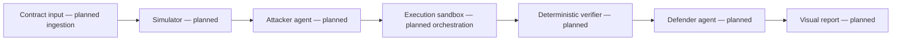

# Architecture and implementation status

The diagram is a **planned research pipeline**, not a description of an operational system.

| Component | Status and intended responsibility |
| --- | --- |
| Local Solidity fixture and Foundry harness | **Implemented:** fake-credit state-change demonstration, access checks, logs, and handwritten assertions in an ephemeral test EVM. |
| Contract input | **Planned:** ingest only approved synthetic fixtures and record code/compiler hashes. |
| Simulator | **Planned:** execute the intended action at a captured baseline and record transaction, state, context, and outcome. The current getter is not this component. |
| Attacker agent | **Planned:** propose bounded, allowed local perturbations. No live-chain tools or deployment authority. |
| Execution sandbox | **Planned:** orchestrate isolated paired replays and retain evidence. Foundry currently provides local test execution only. |
| Deterministic verifier | **Planned:** check input identity, permitted changes, replay results, and outcome differences. Existing fixture assertions are not a general verifier. |
| Defender agent | **Planned:** explain verified evidence and uncertainty without overriding verifier results. |
| Visual report | **Planned:** show expectations, actual outcomes, assumptions, witness references, and inconclusive cases. No report UI exists. |

Proposed evidence includes a case ID, source/compiler/tool versions, transaction fields, baseline state/context, ordered permitted mutations, actual outcome, relevant logs/state deltas, and verifier verdict. Define a versioned schema before implementation. Contracts and agent text are untrusted inputs; generated claims must never be accepted as proof. Deterministic code, rather than an LLM vote, must decide whether the declared mismatch is supported.

NOOA may later be evaluated as an orchestration option; see the [evaluation note](../experiments/nooa-spike/README.md). There is no selected agent runtime, model, or working multi-agent system.
